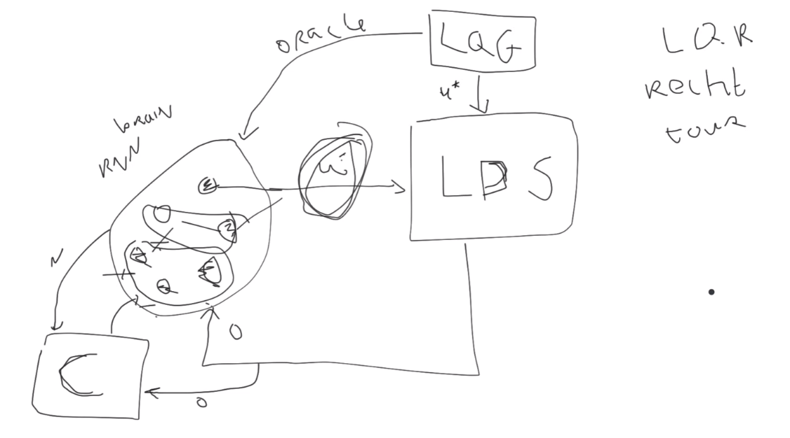

# Neural Control

## Next steps

1. Use LDS - double integrator special case as environment.

2. Use LQG to provide the oracle optimal control output for this problem. Note: with noisy observations the LQG runs a Kaman filter at each tilmestep to determine the optimal control u* = L mu where L is the gain matrix and mu is the Kalman estimate of the state. The latter is why RNNs must integrate over observations (i.e. they need to learn a state estimate).

3. Train mxnet simple RNN with explicit inputs and outputs in supervised manner

4. Fix the RNN (brain) and use this as the setup to test the agent environment interaction as we start to corrupt the RNN

5. Use neural controllers (could initially be PID) that use as input the observations, the desired output (according to LQG), the RNN output and/or a subset of RNN activations and produce as output a stimulation of (a subset of) the neurons

This basic setup allows us to play around with various things: more complex environments, more realistic RNN models, better controllers, more realistic stimulators, etc. But all step by step. First the basics.

Attached some code as starting point but I am working on a cleaner code base. Will share that later. 

Note that this can all be simplified by (1) using the python code in the controller toolbox (no need to implement it all from scratch) and (2) using a simple mxnet pipeline for supervised training of simple RNNs. This might be a nice starting point for you. 

https://python-control.readthedocs.io/en/0.9.0/generated/control.lqr.html

https://python-control.readthedocs.io/en/0.9.0/generated/control.lqe.html
